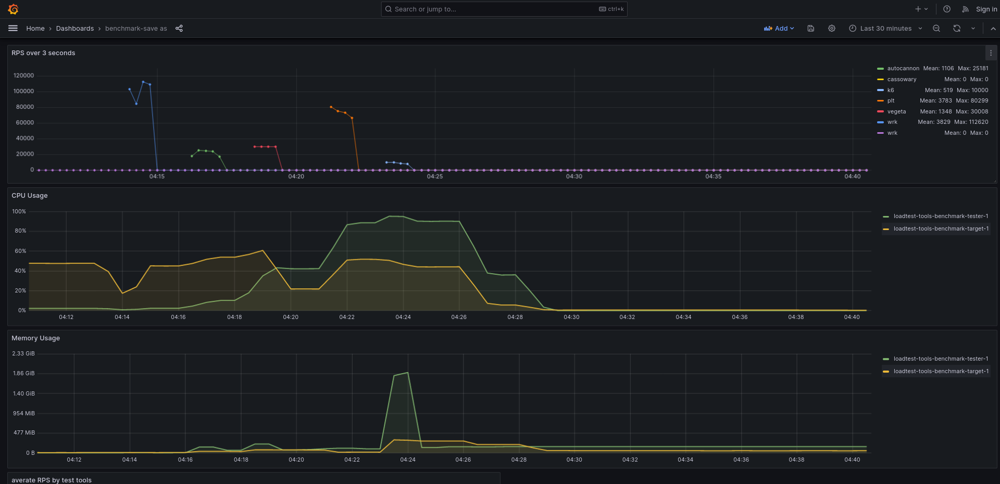

# loadtest-tools-benchmark
benchmark of various load testing tools, focusing on open source, scriptable, command-line based tools

I've read [this great article from the creator of k6 about benchmarking of various load testing tools](https://grafana.com/blog/2020/03/03/open-source-load-testing-tool-review/). However the article was from 2020, and I wish I could have the latest data for the tools I'm currently interested with.

## criteria of the tools I prefers
- open source. its 2024 guys
- support dynamic payload. Only testing static GET or POST requests are useless to me
- command line. I hate GUI tools
- local tools. No cloud based SaaS please
- fast enough. Java & Python seems like a no go

## The tools I plan to look into

Tool | Tech stack | Notes
---|---|---
[wrk](https://github.com/wg/wrk/) | Built with C, scriptable with Lua | Champion
[wrk2](https://github.com/giltene/wrk2) | same as above | Remake of wrk with option for constant rate
[plt](https://github.com/vearutop/plt) | Go | scriptable by modifying go file, included with TUI realtime monitoring
[cassowary](https://github.com/rogerwelin/cassowary) | Go | need to make sure about the scriptability. the docs only mention scripting the parameters
[k6](https://k6.io) | Build with Go, scriptable with Js | huge ecosystem. I just need to check the performance
[Artillery](https://www.artillery.io) | Js | scriptable payload as selecting random item from list of available payloads
[Autocannon](https://github.com/mcollina/autocannon) | Js | -
[Drill](https://github.com/fcsonline/drill) | Rust, scriptable with yaml | -
[Vegeta](https://github.com/tsenart/vegeta) | Go | -
  

## Tools I intentionally excluded (at least for now)
- Java based: jmeter, gatling, ab
- no dynamic payload: hey
- Python based: locust

## Metrics I look out for

For a given target & given testing device specification:
- how many max request could be made
- how much memory used
- latency of the generated requests

## scenarios I plan to test with
- static single GET
- dynamic single POST
- complex multiple requests

## The setup
- Using docker compose, all network calls are made locally
- the target is simple go app with prometheus exporter. the docker compose also included prometheus scrapper & grafana for visualization

## Running

1. clone
2. docker compose up -d
3. open grafana at `localhost:3002`
4. To monitor test results, I have provided 'benchmark' dashboard in this repo. 
  
  however in my experience your dashboard my unable to show the data. To fix it, you could try to edit the panel and then switching between "builder" & "code" query and then clicking "run queries" button until the graph showed the data. after you successfully see the graph, clik "apply" in the upper-right corner. do that to all panels. Dont forget to save the dashboard after you finish with all of the panels. I haven't been able to find why this is happening, but I'll make sure to update this readme after I've done so.
5. To run the benchmark, the test suites are available at `./tester/scripts*.sh` . For example to run the default static single request test suite, run this:
   ```sh
   $ docker compose exec tester sh
   # ./tester/script.sh
   ```
   
## Results

Currently available results:
- [2024-03-01 14:00](https://github.com/azophy/loadtest-tools-benchmark/tree/main/results/20240301_140000)
