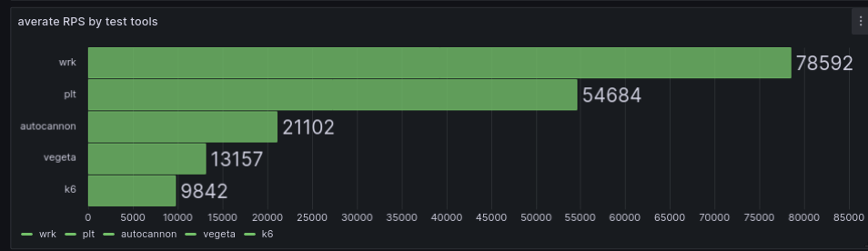
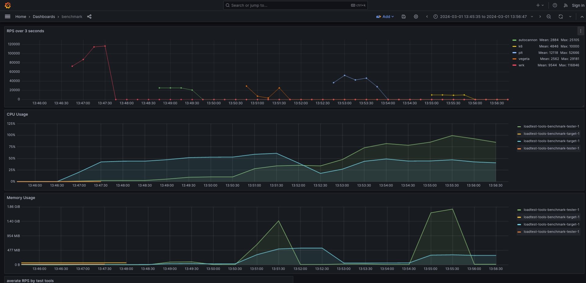

Result in 2024-03-01 14:00:00
=============================

Currently I only succeeded in running 5 tools, all just basic static GET requests:
- wrk
- plt
- autocannon
- vegeta
- k6

the other 3 which I stil haven't been able to run properly:
- drill -> keep getting segfaults
- cassowary -> only get meager results
- artilerry -> keep crashing

I set the spec to 4 CPU 4 Gb RAM for the tester container, and 4 CPU 2 Gb for the target. I run it on my personal 16 CPU 16 Gb RAM laptop.

## results

## conclusion
- wrk won by a huge margin in terms of throughput, memory efficiency, etc.
- all tools besides k6 seems like still able to be tuned to better utilized available resources
- k6 just consumed too much resources, maybe the config also need to be tuned

## Next iteration
- tune the config
- create scenarios for multiple requests & dynamic payload
- run on fresh server to eliminate all possibility of interference from other process
