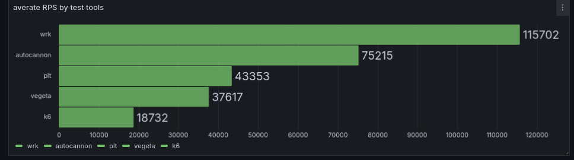
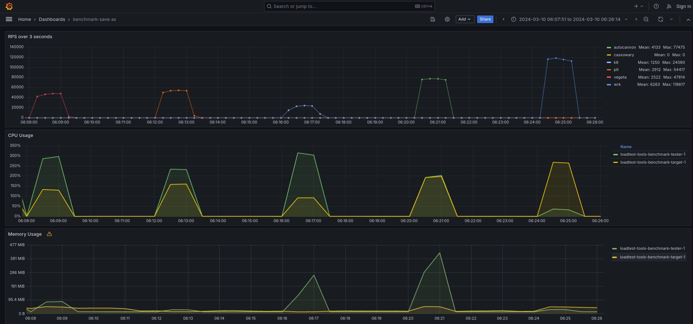

Result in 2024-03-10 06:30:00
=============================

This time I still work with the same 5 tools, all just basic static GET requests:
- wrk
- plt
- autocannon
- vegeta
- k6

the other 3 which I stil haven't been able to run properly:
- drill -> keep getting segfaults
- cassowary -> only get meager results
- artilerry -> keep crashing

I set the spec to 4 CPU 4 Gb RAM for the tester container, and 8 CPU 2 Gb for the target. This time I was able to run it in a fresh dedicated DigitalOcean CPU-Optimized Droplet with 8 vCPU & 16 Gb RAM.

## results

## conclusion
- wrk stil won (albeit with smaller margin then before) terms of throughput, memory efficiency, etc. I've done many thing trying to saturate CPU & Memory usage of the tester machine, but WRK seems just a beast to be able to generate such a huge load with such a small resource consumption.
- I've finally able to tune k6 performance, but still lag behind other tools performances. The resource consumption is also noticably higher compared to other tools
- Vegeta & PLT noticably used large CPU portion but small memory compared to the others. Its interesting as both built using Go language
- Autocannon surprisingly came second place in terms of throughtput & CPU usage, although the memory usage is the highest. However ~400 Mb memory should be acceptable in many situations

## Current verdict
- for people starting with load testing, Autocannon would be my recommendation. With high throughput & support from nodejs ecosystem this tool should be more than enough for most scenarios
- if you require more complex scenario, or even testng non-REST requests, K6 should be your best bet
- choose wrk if you just want to flood your endpoint with as many requests as possible
- if your comfortable with Go, Vegeta & plt should be a good option

## Next iteration
- create scenarios for multiple requests & dynamic payload
- run on server with 16 CPU. Actually this time I was planning to use 16 CPU but misread the information on DigitalOcean setting page
